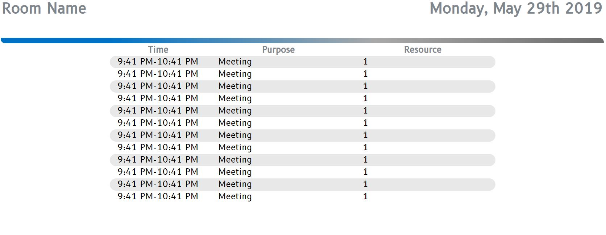

# ASP.NET Exchange Meeting Display Board

  The intialization variables need to be set in the MainForm.aspx to connect to the Exchange EWS service and customize the color of the div bar.  The display board automatically refreshes and will auto scroll through meetings to the bottom of the table then return back to the top.  The meetings are populated via EWS and the service retrieves all meetings from rooms associated with an Exchange RoomList either set statically or passed in through a uri. 

